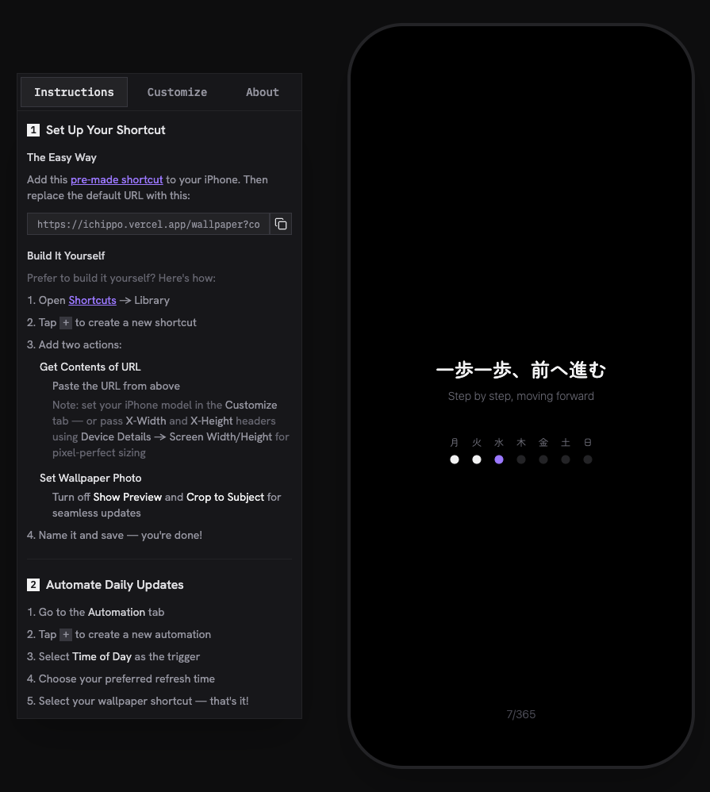

# Ichippo

> `一日一歩` → Ichinichi Ippo → Ichippo

A customizable phone wallpaper generator built with Astro, React, and Tailwind CSS v4. Create personalized wallpapers with calendar, countdown, and phrase widgets.



## Features

- **Visual Editor**: Interactive preview to customize your wallpaper in real-time.
- **Multiple Widgets**:
  - **Calendar**: Display the current month or week.
  - **Days Left**: Countdown to a specific date or event.
  - **Phrase**: Add custom text or quotes.
- **Customizable**: Adjust colors, fonts, and layouts.
- **Device Support**: Optimized for various iPhone models.
- **Export**: Generate high-quality PNG wallpapers using server-side rendering (Puppeteer).

## Tech Stack

- **Framework**: [Astro](https://astro.build)
- **UI Library**: [React](https://react.dev)
- **Styling**: [Tailwind CSS v4](https://tailwindcss.com)
- **Icons**: [Lucide React](https://lucide.dev)
- **Formatting/Linting**: [Biome](https://biomejs.dev)
- **Image Generation**: [Puppeteer](https://pptr.dev) & [@sparticuz/chromium](https://github.com/Sparticuz/chromium)

## Getting Started

### Prerequisites

- Node.js (Latest LTS recommended)
- [pnpm](https://pnpm.io)

### Installation

```bash
git clone <repository-url>
cd ww
pnpm install
```

### Development

Start the development server:

```bash
pnpm dev
```

Visit `http://localhost:4321` to view the app.

### Build

Build the project for production:

```bash
pnpm build
```

Preview the production build:

```bash
pnpm preview
```

## Project Structure

```
src/
├── components/          # Reusable UI components (Button, Input, etc.)
├── features/            # Feature-specific modules
│   ├── controls/        # Control panel UI
│   ├── preview/         # Phone preview logic
│   └── widgets/         # Widget implementations (calendar, days-left, phrase)
├── lib/                 # Utility functions and configuration
├── pages/               # Astro pages and API routes
└── styles/              # Global styles
```

## Scripts

- `pnpm dev`: Start the local development server.
- `pnpm build`: Build the project for production.
- `pnpm preview`: Preview the production build locally.
- `pnpm format`: Format code using Biome.
- `pnpm lint`: Lint code using Biome.
- `pnpm check`: Run Biome checks (formatting + linting).

## Configuration

The application uses `biome.json` for code formatting and linting rules.

To add new widgets, refer to the `src/features/widgets` directory structure. Each widget consists of a display component, controls component, state hook, and type definitions.
